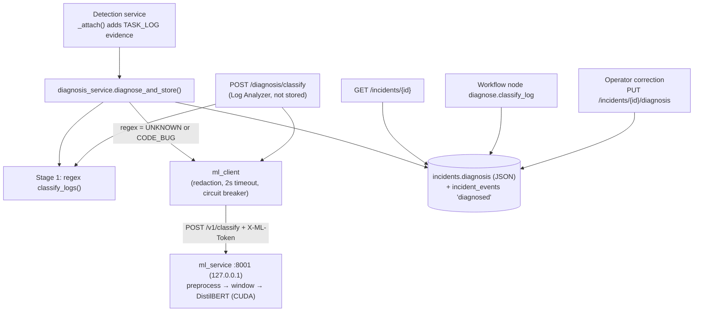
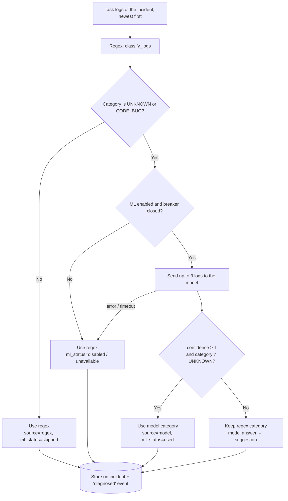
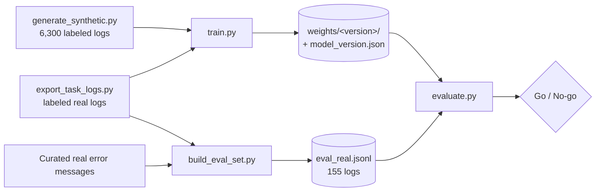

# Failure Diagnosis Module (Hybrid Regex + ML)

| | |
|---|---|
| **Status** | Implemented; model `20261001-0630` passed the go/no-go gate |
| **Plan** | [`aiplan1.md`](../aiplan1.md) |
| **Owners** | Backend (`backend/app/diagnosis`, `backend/app/services/diagnosis_service.py`), ML service (`ml_service/`) |
| **Last updated** | 2026-10-01 |

---

## 1. Summary

When an Airflow DAG run fails, the platform opens an incident and attaches the failed tasks' logs as
evidence. The **diagnosis module** reads those logs and decides *why* the run failed. It picks one of
9 categories (bad credentials, network glitch, out of memory, …) and says whether a retry is likely to
help.

The diagnosis drives automation: workflow conditions branch on the category, and the retry policy
reads `retryable`. Operators see it at the top of the incident page.

It works in two stages:

1. **Regex classifier**: fast, deterministic, explainable rules. It is always run and is the default
   answer.
2. **ML classifier**: a fine-tuned DistilBERT model on a separate GPU service. It is consulted
   **only** when regex is weak (`UNKNOWN` or the catch-all `CODE_BUG`). It may change the category
   **only** when it is confident (≥ `ML_MIN_CONFIDENCE`, default 0.85). Otherwise its answer is
   shown as a display-only *suggestion*.

Every diagnosis is computed **once**, when the evidence arrives, and stored on the incident. Page
views and workflow runs read the stored value. Operators can correct it, and a correction always
wins.

---

## 2. Why a hybrid?

| | Regex alone | Model alone | Hybrid |
|---|---|---|---|
| Speed / cost | Microseconds, no infrastructure | GPU service, ~ms per log | Model only on weak cases |
| Explainable | Yes (rule name + matched line) | Partly (scores, window) | Yes; source is always recorded |
| Unseen log formats | Returns `UNKNOWN` | Generalises | Model fills the gap |
| Generic `ValueError` / `TypeError` | Always `CODE_BUG` (even for network/auth causes) | Reads the context | Model can correct it |
| Failure mode if broken | n/a | Wrong answers | Falls back to regex |

Design principles (from the plan):

1. **Prove value first.** The model was only adopted after it beat regex on an evaluation set (§9).
2. **Diagnose once, persist it.** No model calls on the request path.
3. **Automation only acts on trustworthy categories.** A low-confidence model output is a suggestion only.
4. **Regex is always the fallback.** ML disabled, down or not ready behaves exactly as before.
5. **Operators close the loop.** Corrections are stored and become labeled training data.

---

## 3. Failure categories

Defined in `backend/app/diagnosis/log_classifier.py` (`FailureCategory`). The ML service uses the
same list and order (`ml_service/app/schemas.py`, `CATEGORIES`).

| Category | Label shown to users | Retryable | Typical evidence |
|---|---|---|---|
| `AUTH` | Login or permission problem | No | `password authentication failed`, `AccessDenied`, HTTP 401/403, expired token |
| `DATA_INTEGRITY` | Bad data (constraint violation) | No | `UniqueViolation`, `IntegrityError`, failed data-quality check |
| `SCHEMA` | Table or column changed | No | `UndefinedColumn`, `no such table`, `invalid identifier` |
| `CODE_BUG` | Code error | No | `NameError`, `ImportError`, `AttributeError`, `KeyError` … |
| `RESOURCE` | Out of memory or disk | **Yes** | `MemoryError`, `OOMKilled`, exit 137, `No space left on device` |
| `TIMEOUT` | Timeout | **Yes** | `AirflowTaskTimeout`, `ReadTimeout`, statement timeout |
| `TRANSIENT_NETWORK` | Network glitch | **Yes** | `Connection refused/reset`, DNS failure, 502/503/504, 429 |
| `UPSTREAM_MISSING` | Missing input | **Yes** | `FileNotFoundError`, `NoSuchKey`, missing partition |
| `UNKNOWN` | Unknown | **Yes** | Nothing matched |

`retryable` is **always** derived in the backend from the `RETRYABLE` set. The model never decides
it.

---

## 4. Architecture



### Components

| Component | File | Responsibility |
|---|---|---|
| Regex classifier | `backend/app/diagnosis/log_classifier.py` | Ordered rules, first match wins; returns category, confidence, rule, matched line |
| Hybrid rule | `backend/app/diagnosis/hybrid.py` | Pure decision function `decide()`; model client injected |
| ML client | `backend/app/connectors/ml_client.py` | Sync HTTP client, secret redaction, payload trimming, circuit breaker |
| Diagnosis service | `backend/app/services/diagnosis_service.py` | Diagnose-and-store, backfill, operator override, events, audit |
| Detection hook | `backend/app/services/detection_service.py` (`_attach`) | Triggers diagnosis when new `TASK_LOG` evidence arrives |
| Workflow node | `backend/app/services/automation_nodes.py` (`_classify`) | Reads the stored diagnosis (computes it only if missing) |
| API | `backend/app/api/v1/incidents.py`, `backend/app/api/v1/diagnosis.py` | Incident detail, correction endpoint, Log Analyzer endpoint |
| Storage | `Incident.diagnosis` JSON column; migration `2026_10_01_1200-c7e2a91f5b30_incident_diagnosis.py` | Persisted diagnosis |
| ML service | `ml_service/app/` | FastAPI service: preprocessing, model loading, inference |
| Training | `ml_service/training/` | Synthetic data, training, calibration, evaluation |
| Frontend | `frontend/src/components/diagnosis/DiagnosisCard.jsx`, `frontend/src/pages/diagnosis/LogAnalyzer.jsx` | Incident card, correction dialog, Log Analyzer page |

---

## 5. How a diagnosis is made (step by step)



1. **Trigger.** The detection service attaches evidence to an incident. If any new record is a
   non-empty `TASK_LOG`, it calls `diagnosis_service.diagnose_and_store()`.
2. **Guard.** Only `DAG_RUN_FAILED` incidents are diagnosed. If the stored diagnosis came from an
   operator, it is kept unchanged.
3. **Regex.** `classify_logs()` runs over the incident's logs (newest first) and returns the first
   specific match.
4. **Specific answer?** If regex returned anything other than `UNKNOWN`/`CODE_BUG` (for example
   `RESOURCE` from an OOM line, confidence 0.9), that is the answer. No model call is made.
5. **Ask the model.** Otherwise, if `ML_SERVICE_ENABLED`, the client sends up to 3 logs. Secrets
   are redacted first, and each log is trimmed to its tail so the request stays under 200 KB.
6. **Model failure.** Timeout, connection error, non-200 or a malformed response raises
   `MLUnavailable`. The regex answer is used with `ml_status="unavailable"`. After
   `ML_BREAKER_FAILURES` consecutive failures the circuit opens for
   `ML_BREAKER_COOLDOWN_SECONDS`, and calls fail fast without touching the network.
7. **Confident model.** If `confidence ≥ ML_MIN_CONFIDENCE` and the model's category isn't
   `UNKNOWN`, the model's category becomes final (`source="model"`, `rule="model"`).
   `matched_line` is the model's highest-signal line, so notifications still show evidence.
8. **Unsure model.** Otherwise the regex category stays. If the model proposed a different, known
   category, it is stored as `suggestion` (display only).
9. **Persist.** The payload is written to `incidents.diagnosis`, and a `diagnosed` event is added
   to the incident timeline with category, source, confidence, model version and ML status.

### Reading the diagnosis

- **Incident page (`GET /incidents/{id}`)** returns the stored diagnosis and **never calls the
  model**. Incidents created before this feature have no stored diagnosis; on first read they get a
  regex-only diagnosis that is stored, with a `diagnosed` event marked `backfill: true`.
- **Workflow node `diagnose.classify_log`** uses the stored diagnosis, so the workflow and the
  incident page always agree. If none is stored yet, it computes and stores one.

### Operator correction

`PUT /incidents/{id}/diagnosis` with `{category, note}` (Operator or Admin role):

- The new payload has `source="operator"`, `confidence=1.0`, `corrected_by` and `note`.
- `previous` records what the system said before the **first** correction, and is kept across
  re-corrections.
- Writes a `diagnosis_corrected` timeline event and an `incident.diagnosis_corrected` audit-log
  entry.
- Is **never overwritten** by later re-diagnosis.
- Appears in `backend/scripts/export_task_logs.py` output as `operator_category`, which makes it
  labeled training data.

---

## 6. Stored diagnosis payload

Schema: `DiagnosisRead` in `backend/app/schemas/incident.py`.

| Field | Type | Meaning |
|---|---|---|
| `category` | str | Final category (one of §3) |
| `label` | str | Human-readable label |
| `retryable` | bool | From `RETRYABLE`, never from the model |
| `confidence` | float | Regex rule confidence, model probability, or 1.0 for operator |
| `rule` | str \| null | Regex rule name, `"model"`, `"operator"`, `"no_log"`, `"no_rule_matched"` |
| `matched_line` | str \| null | Evidence line shown in the UI and notifications |
| `source` | `regex` \| `model` \| `operator` | Who decided |
| `model_version` | str \| null | Weights version when the model was consulted |
| `top_predictions` | list `{category, score}` | Model's top-k scores |
| `suggestion` | `{category, label, confidence}` \| null | Low-confidence model answer (display only) |
| `ml_status` | `used` \| `skipped` \| `unavailable` \| `disabled` | What happened with the model |
| `diagnosed_at` | ISO datetime | When it was computed |
| `note`, `corrected_by`, `previous` | | Operator corrections only |

Illustrative example (model override of a regex `UNKNOWN`):

```json
{
  "category": "TRANSIENT_NETWORK",
  "label": "Network glitch",
  "retryable": true,
  "confidence": 0.8812,
  "rule": "model",
  "matched_line": "vendor_client.errors.ApiError: [Errno 111] Connection refused",
  "source": "model",
  "model_version": "20261001-0630",
  "top_predictions": [
    {"category": "TRANSIENT_NETWORK", "score": 0.8812},
    {"category": "TIMEOUT", "score": 0.0301},
    {"category": "AUTH", "score": 0.0175}
  ],
  "suggestion": null,
  "ml_status": "used",
  "diagnosed_at": "2026-10-01T06:45:12.381Z"
}
```

---

## 7. The ML service (`ml_service/`)

A standalone FastAPI app. It loads the newest `weights/<version>/` (or `ML_WEIGHTS_VERSION`) and
serves predictions on the GPU if one is available, otherwise on the CPU.

### 7.1 Preprocessing (`app/preprocess.py`)

Shared **identically** by training and inference, so the model sees the same kind of text in both.

1. **Strip** ANSI colour codes and Airflow line prefixes (`[timestamp] {file.py:NN} LEVEL -`).
   Both the Airflow 2 and 3 formats are handled.
2. **Mask** volatile tokens: UUIDs → `<uuid>`, IPs → `<ip>`, hex ids → `<hex>`, numbers of 4+
   digits → `<num>`. Directory prefixes become `<path>/`; the last two path segments are kept
   because they carry signal (`<path>/requests/adapters.py`).
3. **Window** to the model's 512-token limit by priority:
   - priority 0: exception lines (`SomeError: …`)
   - priority 1: the rest of the last (possibly chained) traceback block, plus `ERROR`/`CRITICAL`
     lines
   - priority 2: the last 30 lines

   Lines are de-duplicated and packed until the token budget is full, then output in original
   order.
4. **Signal line**: the final exception line of the last traceback (or the last error line), kept
   unmasked for display.

With several logs per incident, each is windowed and scored. The most confident non-`UNKNOWN`
result wins.

### 7.2 Model (`app/model.py`)

- `distilbert-base-uncased` fine-tuned for 9-class sequence classification.
- Runs in fp16 on CUDA, inside `torch.inference_mode()`, with a warm-up call at load.
- Applies the **calibration temperature** from `model_version.json`:
  `probs = softmax(logits / T)`. Older weights default to T = 1.0.
- **No zero-shot fallback**: without trained weights the service reports `ready=false`, and the
  backend keeps using regex.

### 7.3 API

| Endpoint | Auth | Body / response |
|---|---|---|
| `GET /v1/health` | none | `{ready, model_version, device, vram_used_mb}` |
| `POST /v1/classify` | `X-ML-Token` header (constant-time compare) | Request `{logs: [str] (1–10), top_k: 1–9}` → `{category, confidence, top_predictions, model_version, signal_line, window, device, inference_ms}` |

Errors: `401` (missing or bad token; an empty server token rejects everything), `413` (body >
256 KB), `422` (invalid body), `503` (model not ready).

**Security:** the service binds to `127.0.0.1` by default because logs can contain secrets. The
backend also redacts `password=`, `token=`, API keys, `Authorization`/Bearer values and URL
credentials before sending anything.

---

## 8. Training pipeline (`ml_service/training/`)



### 8.1 Data

| Dataset | File | Size | Purpose |
|---|---|---|---|
| Synthetic | `data/synthetic.jsonl` | 6,300 logs from 292 templates (700 per category) | Training + validation |
| Exported real | `data/exported_task_logs.jsonl` | 1 log so far | Labeled rows go to training (if not in the eval set) |
| Evaluation | `data/eval_real.jsonl` | 155 logs (1 exported, 154 curated) | Go/no-go gate; **never trained on** |

**Synthetic generator (`generate_synthetic.py`).** Hand-written templates of real library error
messages per category (psycopg2, boto3, Snowflake, BigQuery, Spark, requests, dbt, Kubernetes, …).
They are deliberately **not** derived from the regex patterns. Slots (`{table}`, `{host}`, `{col}`
…) are filled randomly, and each message is wrapped in realistic Airflow 2/3 boilerplate. Every
sample is rendered in one of these styles:

| Style | What it teaches |
|---|---|
| `traceback` | Standard Python traceback ending in the cause |
| `plain_error` | A single `ERROR -` line, no traceback |
| `chained` | Real cause in the inner traceback; the outer exception is generic, **including built-in `TypeError`/`KeyError`/`AttributeError`**, so built-in errors ≠ code bug |
| `reraise` | Cause re-raised as `ValueError`/`RuntimeError`/`AirflowException` |
| `buried` | Cause is one ERROR line among 20–80 INFO lines |
| `custom` | Cause message under an in-house class (`etl.errors.LoadError`), so the class name alone never decides |

Every sample also gets 0–4 **distractor** lines: INFO/WARNING lines that mention other categories'
words without being the cause (e.g. "Connection reset by peer; retrying", "Refreshed access token",
"Memory usage: 12 GB").

**Evaluation set (`build_eval_set.py`).** Real-world failure messages, hand-labeled one by one and
written independently of the synthetic templates. It **over-represents logs that regex gets wrong**
on purpose, which is why regex scores low on it. Exported logs are included only once a human has
labeled them or an operator has corrected them.

### 8.2 Training (`train.py`)

1. Split synthetic data **by template id**: 15% of templates per category are held out for
   validation, so it never sees a training template. This gave 5,329 training and 971 validation
   logs.
2. Add labeled exported real logs that are not in the evaluation set.
3. Window every log with the same preprocessor as inference.
4. Fine-tune `distilbert-base-uncased` with the Hugging Face `Trainer`:

   | Hyperparameter | Value |
   |---|---|
   | Epochs | 3 |
   | Batch size | 16 (eval 32) |
   | Learning rate | 5e-5, AdamW, 6% warm-up, weight decay 0.01 |
   | Label smoothing | 0.1 |
   | Precision | fp16 on CUDA |
   | Model selection | Best epoch by validation macro-F1 |

5. **Calibrate.** Fit one softmax temperature `T` on the validation logits by minimising
   negative log-likelihood (LBFGS on `log T`). Report expected calibration error (ECE) before and
   after.
6. Save to `weights/<yyyymmdd-hhmm>/` with `model_version.json`, which records the base model,
   labels, data hash, split sizes, hyperparameters, temperature, ECE, device, training time and
   validation metrics. The temporary `weights/.run-*` checkpoint folder is deleted.

### 8.3 Evaluation (`evaluate.py`)

Runs three approaches over `eval_real.jsonl`:

- **Regex alone**: the backend's `log_classifier.py`, loaded by file path.
- **Model alone**.
- **Hybrid**: the same rule as `backend/app/diagnosis/hybrid.py`.

It prints per-category precision/recall/F1 and a threshold sweep, and checks the gate. Results go
to `data/eval_report.json` (per-log predictions) and into the model's `model_version.json` under
`real_eval`.

**Go/no-go gate.** The model may change categories in production only if, at the chosen T:

| | Condition | Why |
|---|---|---|
| (a) | Hybrid accuracy ≥ regex accuracy | Never worse than today |
| (b) | Hybrid correctly classifies ≥ 50% of logs regex marks `UNKNOWN` | It must add real value |
| (c) | **Override precision ≥ 0.90** (when the model overrides, it is right ≥ 90% of the time) | Automation acts on overrides |

---

## 9. Results

### 9.1 Version history

| Version | Data | Training | Synthetic val macro-F1 | Gate |
|---|---|---|---|---|
| `20261001-0602` | 4,500 logs / 228 templates | 4 epochs, no smoothing, no calibration | 0.701 | **NO-GO** (c failed) |
| `20261001-0630` | 6,300 logs / 292 templates, hard negatives, prefix bug fixed | 3 epochs, label smoothing 0.1, T = 1.104 | 0.765 | **GO** |

Both were trained on an NVIDIA GeForce RTX 3050 Laptop GPU in about 5.5 minutes (328.6 s and
335.3 s).

### 9.2 Headline comparison (evaluation set, 155 logs, T = 0.85)

| Metric | Regex alone | v0602 hybrid | **v0630 hybrid** | v0630 model alone |
|---|---|---|---|---|
| Accuracy | 37.4% | 69.0% | **76.8%** | 83.2% |
| Weak-regex logs correct (of 113) | 23 | 72 | **84** | – |
| Regex-`UNKNOWN` logs correct (of 81) | 11 | 50 | **61** | – |
| Model overrides | – | 101 | **72** | – |
| Override precision (gate c) | – | 68.3% ❌ | **93.1% ✅** | – |

Regex scores low because the evaluation set deliberately over-represents its failure cases. On
everyday logs regex is far more accurate. The point of the comparison is what the model adds where
regex is weak.

### 9.3 Per-category F1 (v0630)

| Category | Regex | Model alone | Hybrid (T=0.85) | Support |
|---|---|---|---|---|
| AUTH | 0.429 | 0.923 | 0.778 | 21 |
| DATA_INTEGRITY | 0.273 | 0.789 | 0.848 | 19 |
| SCHEMA | 0.381 | 0.909 | 0.839 | 17 |
| CODE_BUG | 0.462 | 0.744 | 0.739 | 20 |
| RESOURCE | 0.522 | 0.938 | 0.867 | 17 |
| TIMEOUT | 0.571 | 1.000 | 0.889 | 15 |
| TRANSIENT_NETWORK | 0.452 | 0.762 | 0.703 | 18 |
| UPSTREAM_MISSING | 0.316 | 0.778 | 0.839 | 16 |
| UNKNOWN | 0.237 | 0.588 | 0.513 | 12 |
| **Macro avg** | 0.405 | 0.826 | 0.779 | 155 |

The model alone beats the hybrid on accuracy because the hybrid keeps regex's answer wherever regex
matched a specific rule, including a few regex mistakes (mostly the network rule firing on lines
that are not the root cause). That is the intended trade-off: the model never overrides a specific
regex rule.

### 9.4 Threshold sweep (v0630)

| T | Hybrid accuracy | Regex-UNKNOWN fixed | Overrides | Override precision |
|---|---|---|---|---|
| 0.50 | 0.806 | 64/81 | 98 | 0.816 |
| 0.60 | 0.806 | 64/81 | 95 | 0.832 |
| 0.70 | 0.800 | 64/81 | 90 | 0.856 |
| 0.80 | 0.800 | 65/81 | 82 | 0.902 |
| **0.85** | **0.768** | **61/81** | **72** | **0.931** |
| 0.90 | 0.374 | 11/81 | 0 | – |

**Important:** label smoothing caps the model's confidence at about **0.90** (max 0.8986 on the
evaluation set; median 0.880). The usable range for `ML_MIN_CONFIDENCE` is therefore narrow: 0.85
is right, while 0.9 or above means the model never overrides. If a retrained model's scores drop
below the threshold, the system **fails safe** (regex decides), but each new version must be
re-evaluated before the threshold is trusted.

### 9.5 Calibration (v0630, synthetic validation split)

| | ECE |
|---|---|
| Before temperature scaling | 0.070 |
| After (T = 1.104) | 0.043 |

For v0602 (no calibration) wrong answers had a median confidence of **0.986**, so no threshold
could separate them from right answers. That was the root cause of the NO-GO.

### 9.6 What changed between v0602 and v0630

Diagnosed from the category-level confusion of v0602's wrong overrides only. The evaluation logs'
text was not used, to avoid tuning on the test set.

| Problem in v0602 | Evidence | Fix |
|---|---|---|
| Training text didn't look like real logs | Doubled braces (`{{taskinstance.py}}`) in the generator left `} INFO -` fragments on most benign lines in ~60% of training logs | Single braces; 0 artifacts verified |
| "Built-in exception ⇒ CODE_BUG" shortcut | 19 of 32 wrong overrides were "→ CODE_BUG" | `custom` style, built-in outer exceptions in `chained`, more non-code templates using built-in errors |
| Model almost never said UNKNOWN | 2/12 recall | 22 new vague/opaque UNKNOWN templates |
| Keyword matching | Network/auth words in benign lines | Distractor lines |
| Overconfidence | Median confidence of wrong answers 0.986 | Label smoothing 0.1 + temperature scaling; 3 epochs instead of 4 |

---

## 10. Configuration

### Backend (`backend/app/core/config.py`, environment variables)

| Variable | Default | Meaning |
|---|---|---|
| `ML_SERVICE_ENABLED` | `false` | Off = regex only, exactly as before |
| `ML_SERVICE_URL` | `http://127.0.0.1:8001` | ML service base URL |
| `ML_SERVICE_TOKEN` | `""` | Shared secret sent as `X-ML-Token` |
| `ML_SERVICE_TIMEOUT_SECONDS` | `2` | Per-request timeout |
| `ML_MIN_CONFIDENCE` | `0.85` | Threshold T for model overrides (see §9.4) |
| `ML_BREAKER_FAILURES` | `3` | Consecutive failures before the circuit opens |
| `ML_BREAKER_COOLDOWN_SECONDS` | `60` | How long the circuit stays open |

Set `ML_MIN_CONFIDENCE` above 1 (e.g. `1.01`) for **suggestion-only mode**. The model is shown in
the UI but never changes a category.

### ML service (`ml_service/app/config.py`)

| Variable | Default | Meaning |
|---|---|---|
| `ML_SERVICE_TOKEN` | `""` | Must match the backend; empty rejects every request |
| `ML_WEIGHTS_DIR` | `ml_service/weights` | Where versioned weights live |
| `ML_WEIGHTS_VERSION` | newest | Pin a specific `weights/<version>` |
| `ML_DEVICE` | auto | `cuda` if available, else `cpu` |
| `ML_MAX_BODY_BYTES` | `262144` | Request size cap (256 KB) |
| `ML_HOST` / `ML_PORT` | `127.0.0.1` / `8001` | Bind address |

---

## 11. Backend API

| Method & path | Role | Description |
|---|---|---|
| `GET /api/v1/incidents/{id}` | Viewer+ | Incident detail including the stored `diagnosis` (regex backfill for old incidents; no model call) |
| `PUT /api/v1/incidents/{id}/diagnosis` | Operator+ | Body `{category, note?}`. Operator correction. 400 on unknown category, 409 for non-failed-run incidents |
| `POST /api/v1/diagnosis/classify` | Viewer+ | Body `{log}` (≤ 256 KB, else 413). Returns `{regex, model, final, ml_status, threshold, window}`. **Not stored** |

---

## 12. Frontend

- **Diagnosis card** (incident page, `DiagnosisCard.jsx`) shows:
  - category label, a source pill (Regex / Model *version* / Operator), a retry badge and the
    confidence
  - the evidence line
  - a "Suggested by the model" line when a suggestion exists
  - collapsible top-k score bars (plain CSS, no chart library) and the model status
  - for Operator/Admin, a **Correct category** dialog with a category select and an optional note
- **Timeline**: `Diagnosed` events show category, source and model version (and "backfilled");
  `Diagnosis corrected` shows `old → new`.
- **Log Analyzer** (`/diagnosis/analyzer`, sidebar → Diagnosis): paste a log to see the final
  decision with an explanation of *why*, regex and model results side by side, and **"What the
  model saw"**, the exact preprocessed window. That window replaces attention-based token
  highlighting, which is not a reliable explanation.

### Workflow block: "Diagnose failure"

The `diagnose.classify_log` block in the workflow editor (shown as "Diagnose failure", in the
*Decide* stage) reads the stored diagnosis and **branches on it**. It needs an incident trigger.

| Output | Label | Taken when |
|---|---|---|
| `retryable` | retry may help | `TRANSIENT_NETWORK`, `TIMEOUT`, `RESOURCE`, `UPSTREAM_MISSING` |
| `needs_fix` | needs a fix | `AUTH`, `DATA_INTEGRITY`, `SCHEMA`, `CODE_BUG` |
| `unknown` | unknown | `UNKNOWN`, or confidence below the block's minimum |
| `next` | any outcome | The outcome's own output is not connected |

**Fallback rule:** if the chosen outcome has no outgoing link, the block follows *any outcome*.
Workflows built before the outcome outputs existed (including the three built-in templates, which
use `next` → "Only if…" filter) therefore behave exactly as before.

| Setting | Default | Effect |
|---|---|---|
| Minimum confidence (%) | empty (no minimum) | Below it, the outcome is `unknown`. Operator corrections always pass. Model scores top out around 90%, so 90+ effectively ignores model answers |
| Re-check the latest logs | off | Re-diagnoses from all current logs (`diagnose_and_store`) instead of reading the stored result. Operator corrections are still kept |

The diagnosis is placed in the run context with an extra `outcome` field, so notifications and
notes can use `{{diagnosis.label}}`, `{{diagnosis.category}}`, `{{diagnosis.source}}`,
`{{diagnosis.matched_line}}` and `{{diagnosis.outcome}}`. The step message reads e.g.
`Diagnosis: Network glitch (model 20261001-0630, 88%) → retry may help`. Tests:
`backend/tests/test_diagnose_block.py`.

---

## 13. Operations runbook

All ML commands run from `ml_service/` with its virtualenv. Use a CUDA build of torch, e.g.
`pip install torch==2.11.0 --index-url https://download.pytorch.org/whl/cu128`, then
`pip install -r requirements.txt`.

| Task | Command |
|---|---|
| Export real logs for labeling | `cd backend && python scripts/export_task_logs.py --only-weak` |
| Rebuild the evaluation set | `python -m training.build_eval_set` |
| Regenerate synthetic data | `python -m training.generate_synthetic` |
| Train a new model | `python -m training.train` (options: `--epochs`, `--batch-size`, `--lr`, `--label-smoothing`) |
| Evaluate / apply the gate | `python -m training.evaluate [--version <dir>] [--threshold 0.85]` |
| Run the service (native) | `python -m uvicorn app.main:app --host 127.0.0.1 --port 8001` |
| Run the service (Docker, GPU) | `docker compose --profile ml up -d ml-service` (from the repo root) |
| Check the service | `GET http://127.0.0.1:8001/v1/health` |
| Tests | `python -m pytest` in `ml_service/` and in `backend/` |

**Releasing a new model:**

1. Train.
2. Run `evaluate.py`. Deploy only on **GO**.
3. Check the sweep and keep T inside the model's confidence range.
4. Restart the service, which loads the newest weights, or pin `ML_WEIGHTS_VERSION`.
5. Watch the incident timelines for `source=model` diagnoses and for operator corrections.

**Rolling back:** set `ML_WEIGHTS_VERSION` to the previous folder and restart, or set
`ML_SERVICE_ENABLED=false` for regex only. No data migration is needed either way.

**Docker:** `ml_service/Dockerfile` builds on `pytorch/pytorch:2.11.0-cuda12.8-cudnn9-runtime`.
Weights are mounted read-only from `ml_service/weights`, and the port is published only on
`127.0.0.1`. It needs the NVIDIA container toolkit (WSL2 GPU support on Windows). A plain
`docker compose up` does not start it.

---

## 14. Testing

| Suite | Tests | Covers |
|---|---|---|
| `backend/tests/test_hybrid_diagnosis.py` | 19 | Every branch of the decision rule; `retryable` from the backend; ≤ 3 logs sent; token + redaction; breaker opens after 3 failures and recovers after cooldown; bad payload / connection errors; persistence + `diagnosed` event; operator override wins and survives re-diagnosis; role checks and validation; detail page backfills without calling the model; Log Analyzer with ML disabled/enabled; 413 and 401 |
| `backend/tests/test_diagnose_block.py` | 9 | Workflow block: catalog entry, old/new wiring validates, outcome rules, routes `retryable` / `needs_fix` / `unknown` through the engine, minimum confidence, fallback to *any outcome*, refresh picks up new logs, operator correction passes the threshold and survives refresh |
| `backend/tests/test_plan2_diagnosis_adapter.py` | – | Regex classifier rules (unchanged) |
| `ml_service/tests/test_preprocess.py` | – | Prefix stripping, masking, windowing |
| `ml_service/tests/test_api.py` | – | Auth, size cap, not-ready response (stub predictor, no GPU) |

Full backend suite: 325 passed, 2 skipped. ML service: 14 passed. All existing tests pass with
`ML_SERVICE_ENABLED=false`.

---

## 15. Known limitations and next steps

1. **The evaluation set is mostly curated, not from our pipelines** (1 of 155 is exported). It has
   also now been used for two iterations. Treat the 93% override precision as optimistic until it
   is confirmed on our own labeled logs.
2. **UNKNOWN recall is low** (5/12). This costs coverage, not safety, because a model `UNKNOWN`
   never overrides.
3. **Narrow threshold window** (§9.4). Re-check it for every new model version.
4. **Regex network rule false positives.** It fires on `503` or `ConnectionError` lines that are
   not the root cause, and the hybrid trusts it. Narrowing that rule is independent of the model.
5. **Small evaluation set** (12–21 logs per category). Per-category scores carry roughly ±10
   points of noise.

Recommended next steps:

- Export and hand-label 150–300 real logs (`export_task_logs.py --only-weak`) and rebuild the
  evaluation set from them.
- Feed operator corrections back into training.
- Add more UNKNOWN examples.
- Consider less label smoothing, or rescaling scores, to widen the threshold range.

---

## 16. File map

```text
backend/
  app/diagnosis/log_classifier.py      regex rules, categories, RETRYABLE
  app/diagnosis/hybrid.py              decision rule (pure)
  app/connectors/ml_client.py          HTTP client, redaction, circuit breaker
  app/services/diagnosis_service.py    diagnose_and_store, ensure, stored_or_backfill, set_override
  app/services/detection_service.py    hook in _attach()
  app/services/automation_nodes.py     diagnose.classify_log node (_classify)
  app/api/v1/incidents.py              detail + PUT /{id}/diagnosis
  app/api/v1/diagnosis.py              POST /diagnosis/classify
  app/schemas/incident.py              DiagnosisRead, DiagnosisOverride, ClassifyLog*
  app/models/incident.py               Incident.diagnosis
  alembic/versions/2026_10_01_1200-c7e2a91f5b30_incident_diagnosis.py
  scripts/export_task_logs.py
  tests/test_hybrid_diagnosis.py
ml_service/
  app/{config,main,model,preprocess,schemas}.py
  training/{generate_synthetic,build_eval_set,dataset,train,evaluate}.py
  data/{synthetic,eval_real,exported_task_logs}.jsonl, eval_report.json
  weights/<version>/                   model + tokenizer + model_version.json (git-ignored)
  tests/{test_preprocess,test_api}.py
  requirements.txt, Dockerfile, .dockerignore, .gitignore
frontend/src/
  components/diagnosis/DiagnosisCard.jsx
  pages/diagnosis/LogAnalyzer.jsx
  pages/incidents/IncidentDetail.jsx   (uses DiagnosisCard)
  services/endpoints.js                incidentsApi.setDiagnosis, diagnosisApi.classifyLog
docker-compose.yml                     ml-service under profile "ml"
```

---

## 17. Glossary

| Term | Meaning |
|---|---|
| **Weak regex result** | `UNKNOWN` or `CODE_BUG`, the only cases where the model is consulted |
| **Override** | The model's category replaces the regex category (confidence ≥ T, not UNKNOWN) |
| **Override precision** | Share of overrides that are correct (gate c) |
| **Suggestion** | A low-confidence model answer, shown but never acted on |
| **Window** | The cleaned, masked, ≤ 512-token excerpt of a log the model actually reads |
| **Temperature (T_cal)** | Divisor on the logits fitted after training so confidences match accuracy |
| **ECE** | Expected calibration error: average gap between confidence and accuracy |
| **Macro-F1** | F1 averaged over categories equally, so rare categories count as much as common ones |
| **Template split** | Validation holds out whole templates, so it measures generalisation, not memorisation |

## Choose the fix + local AI

The **Choose the fix** block (`decide.choose_fix`) turns the diagnosis, earlier fix attempts, the
daily action limit and the DAG's state into one fix: retry, rerun, wait, pause, escalate or ignore
(`backend/app/automation/remediation.py`). The rules also return `allowed`, every fix that is safe
in that situation.

A local LLM (Ollama) can take part, set per block with **Local AI**:

| Mode | Effect |
|---|---|
| `off` (default) | The rules decide alone |
| `suggest` | The rules route; the AI's pick, reason and confidence are stored in `decision.ai` |
| `decide` | The AI's pick routes, if it is in `allowed` and above *Minimum AI confidence* |

Guard rails:
- The AI is only asked when more than one fix is allowed. Resolved incidents, paused DAGs and
  failures that need a code or data change never reach it.
- Ollama constrains the answer to a JSON schema whose `fix` is an enum of `allowed`. The backend
  checks it again.
- If the AI is down, slow, wrong or unsure, the rules' choice stands. `decision.ai.status` says why:
  `used`, `rejected`, `low_confidence`, `unavailable`, `disabled` or `skipped`.
- Logs are redacted before they are sent, and only the last 150 lines are sent. Nothing leaves the
  machine.

Setup:

```
ollama pull qwen3:4b          # ~2.5 GB; fits a 4 GB GPU next to DistilBERT
# backend/.env
DECISION_LLM_ENABLED=True
DECISION_LLM_MODEL=qwen3:4b    # any Ollama model, e.g. llama3.2
```

Client: `backend/app/connectors/decision_llm.py`. It has the same circuit breaker as the ML
client. The first call loads the model (~30 s), and the model then stays loaded for 30 minutes.
Tests: `backend/tests/test_choose_fix_block.py`.
